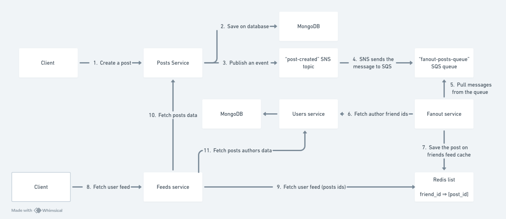

# Introduction

This is a simple news feed system that works as described in the diagram bellow:



# Running

```bash
sudo bash ./init.sh
```

# Obs

1. The applications are running on:
   Posts: localhost:3000
   Feeds: localhost:3001
   Users: localhost:3002
2. The swagger docs is on endpoint /api
3. If a proto file is changed, run "npm run grpc:gen-types" to generate the typescript types file based on the proto file.
4. This is just a basic test demo app, so there are only very simple features.
5. The posts fanout works in a push style. With this approach, news feed is pre-computed during write time. The post is delivered to friends cache immediately after is published. In a real case scenario, a hybrid approach (pull and push model) might be a better solution.

# Techs used

- Node.js + NestJS
- gRPC
- MongoDB
- Redis
- SNS
- SQS
